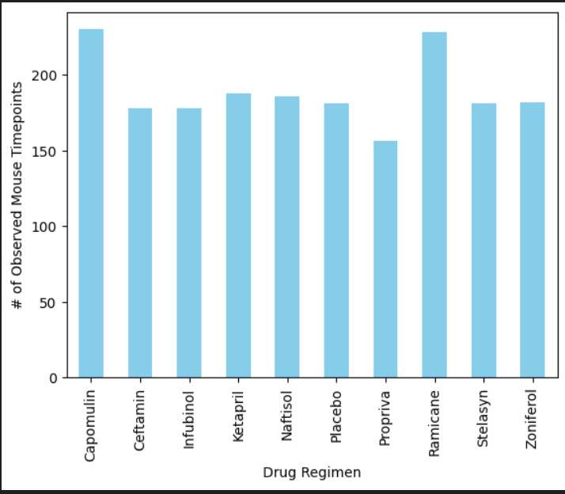

# Pymaceuticals Analysis

## Description
Analyzing the result of 10 different drugs for cancer

## Table of Contents
- [Installation](#installation)
- [Usage](#usage)
- [Credits](#credits)
- [License](#license)
- [Features](#features)
- [Tests](#tests)
- [Contact](#contact)

## Installation
pandas, python, matplot

## Usage
Run the jupyter notebook file and visualize the results

## Credits
Marcos Rodriguez

## License
MIT

## Features
It provides piecharts, scatter , linear regressions and bar charts

## Tests
confirm that the file run without errors

## Contact
If there are any questions of concerns, I can be reached at:
##### [github: marcos25090](https://github.com/marcos25090)
##### [email: marcosrodmeza@gmail.com](mailto:marcosrodmeza@gmail.com)
